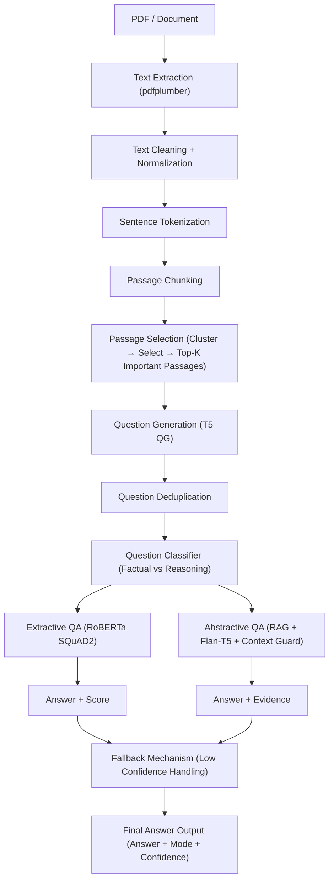

# 📄 Document QA using Hybrid LLMs

[](https://github.com/Samruddhi-jadh/Document-Analysis-using-LLMs-with-Python/blob/main/Document_Analysis.ipynb)


## 🔹 Overview

This project implements a **hybrid Question-Answering system for documents**.
It combines **extractive QA** (for factual questions) with **abstractive QA using RAG + LLM** (for reasoning-based questions). The system ensures answers are **clean, grounded, and confidence-scored**, minimizing hallucinations while providing meaningful insights.

> Inspired by: [Document Analysis using LLMs with Python](https://amanxai.com/2024/10/21/document-analysis-using-llms-with-python/)

---

## 🧰 Features

* PDF/Text extraction and preprocessing using `pdfplumber`
* Passage chunking and Top-K important passage selection
* LLM-based question generation (T5 QG) with deduplication
* **Hybrid QA pipeline**:

  * Extractive QA (RoBERTa SQuAD2)
  * Abstractive QA with context guard (Flan-T5 + RAG)
* Confidence scoring & fallback mechanism
* Clean, normalized, human-readable answers

---

## ⚙️ System Pipeline

**Workflow:**



---

## 📂 Repository Structure

```
.
├── Sample Data/               # Sample PDFs or documents
├── notebook/          # Jupyter / Colab notebooks
├── requirements.txt    # Python dependencies
└── README.md           # Project overview and instructions
```

---

## 🚀 How to Run

```bash
# Install dependencies
pip install -r requirements.txt

# Run notebook
jupyter notebook notebooks/Document Analysis.ipynb

```

---

## 📌 Notes

* Designed to handle **large documents efficiently**
* **Hybrid QA** reduces hallucinations while maintaining reasoning
* **Confidence scores** indicate reliability of answers
* Supports **extensible modular code** for future improvements
